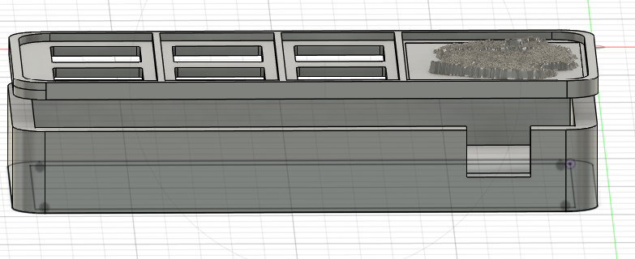
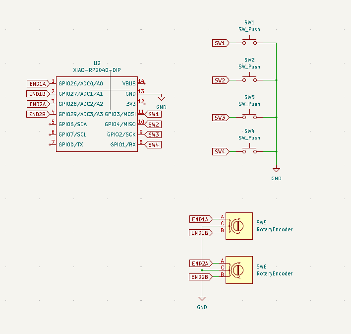
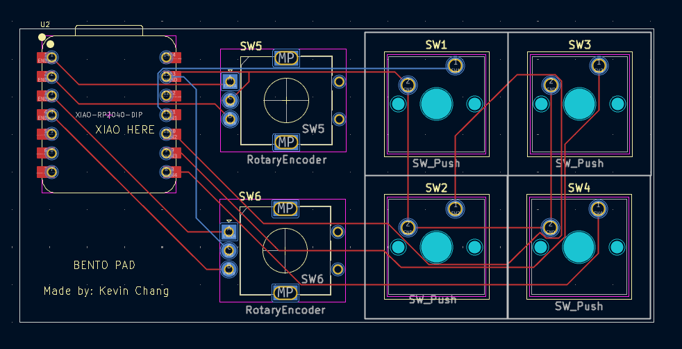

# BentoPad

The 4 white keycaps will be the "rice", one rotary encoder will be a sushi and the other will be an
eggroll. Combined with the 3d printed pork katsu, after painting the macropad will look like a bento box!

**Overall Hackpad**  

**Schematic**  

**PCB**  

**Assembly (done with superglue)**  

**BOM:**  
- Seeed XIAO RP2040
- 4x MX-Style switches
- 2x EC11 Rotary encoders
- 4x Blank DSA keycaps (White)